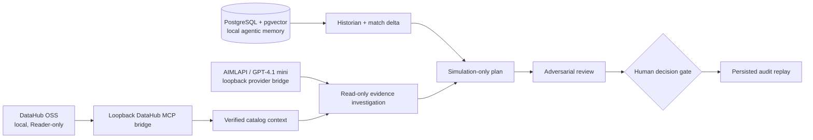

# EvidenceOps

EvidenceOps is an evidence-gated incident command center for infrastructure
operations. It combines a CockroachDB infrastructure catalog and vector incident
memory with AWS Bedrock reasoning, then keeps proposed remediation behind an
explicit human decision gate with immutable audit replay.

> EvidenceOps gathers the facts, remembers what worked, and requires a human
> before anything acts.

EvidenceOps originated as the RecallOps entry for the DataHub Agent Hackathon;
the CockroachDB, AWS, infrastructure-catalog, and vector-memory work was built
for the CockroachDB × AWS Hackathon.

**License:** [Apache-2.0](LICENSE)

## What it does

- Maps an active infrastructure incident's server, site, service, and campaign
  blast radius from a CockroachDB catalog.
- Retrieves comparable resolved incidents using CockroachDB Distributed Vector
  Indexing and explains the match delta.
- Runs GPT-OSS 120B through AWS Bedrock against a forced read-only evidence
  tool, then validates its output before persisting it.
- Simulates a human-approved remediation and exposes its audit replay.

The AWS Lightsail deployment runbook is in
[`docs/lightsail-deployment.md`](docs/lightsail-deployment.md).

The incident narrative is intentionally labeled as a fixture. Live DataHub and
PostgreSQL states are shown separately in the interface and are never presented
as fixture data.

## Architecture



## Prerequisites

- Node.js 22.13 or newer
- Docker Desktop for PostgreSQL and optional local DataHub
- Python `uvx` for the DataHub MCP server and smoke test

## Local setup

Start with a fresh clone:

```powershell
git clone https://github.com/resilientbeast/recallops.git
cd recallops
if (!(Test-Path .env.local)) { Copy-Item .env.local.example .env.local }
npm install
```

On macOS or Linux, use this equivalent copy command:

```bash
[ -f .env.local ] || cp .env.local.example .env.local
```

`.env.local.example` includes every supported environment variable and contains
only safe placeholders. Keep real credentials in `.env.local`; it is ignored by
Git.

### 1. Fastest start: fixture-only console

No Docker services or credentials are required for this path:

```powershell
npm run dev
```

Open [http://localhost:3000](http://localhost:3000). The console clearly labels
fixture-only incident context and historical memory.

### 2. Add durable PostgreSQL memory

With Docker Desktop running:

```powershell
npm run postgres:bootstrap
npm run postgres:api
npm run dev
```

The bootstrap command creates a local `pgvector` PostgreSQL container with a
named Docker volume and fills `POSTGRES_MEMORY_URL` in `.env.local`. The REST
bridge runs on `127.0.0.1:5434`; PostgreSQL itself runs on `127.0.0.1:5433`.
Load the app once to seed the dossier and historical records, then verify:

```powershell
npm run postgres:smoke
```

### 3. Add live DataHub catalog context

Start the pinned authentication-enabled local DataHub stack:

```powershell
.\infra\datahub\bootstrap-auth-enabled.ps1
```

Create a DataHub service account with the **Reader** role, then add its token
to `DATAHUB_GMS_TOKEN` in `.env.local`. Do not use a personal or writer token.

Verify the read-only MCP contract:

```powershell
npm run datahub:smoke
```

Set a random `DATAHUB_MCP_BRIDGE_TOKEN` in `.env.local`, then start the
loopback-only bridge in a separate terminal:

```powershell
npm run datahub:mcp-bridge
```

Use `DATAHUB_CONTEXT_MODE=auto` for a visible GraphQL compatibility fallback,
or `DATAHUB_CONTEXT_MODE=mcp` to fail closed unless the MCP bridge is healthy.
Restart `npm run dev` after changing environment values. A successful live card
states **Via DataHub MCP**.

If the local bootstrap graph is empty, configure a separate short-lived writer
token as `DATAHUB_SEED_TOKEN`, run `npm run datahub:seed`, and revoke that
token afterward. The normal app and MCP bridge do not use it.

### 4. Add model-backed investigation

Set `AIMLAPI_KEY` in `.env.local`. `openai/gpt-4.1-mini` is the default model;
you may override it with `AIMLAPI_MODEL`. Set a distinct random
`AIMLAPI_BRIDGE_TOKEN` when possible.

Start the loopback-only provider bridge in another terminal:

```powershell
npm run ai:bridge
```

Then run or restart the app:

```powershell
npm run dev
```

Choose **Run AI investigation** in the UI. The model must first call the
server-side read-only evidence tool. RecallOps rejects output that changes the
three supplied hypotheses, lacks evidence, or cites an unknown evidence ID. No
model tool can write to DataHub or execute a remediation.

## Verification

Run the complete local quality suite:

```powershell
npm run check
```

For optional integrations, run their smoke tests after the relevant local
service is configured:

```powershell
npm run postgres:smoke
npm run datahub:smoke
```

## API surface

- `GET /api/incidents/INC-247` returns the incident dossier and historical
  memory match.
- `POST /api/incidents/INC-247/agent-run` starts the explicit read-only model
  investigation when AIMLAPI is configured.
- `POST /api/incidents/INC-247/decisions` records an idempotent simulated
  approval or review request.
- `GET /api/datahub/context` returns normalized catalog context through the
  configured MCP or compatibility path.

## Safety boundaries

| Capability | Boundary |
| --- | --- |
| DataHub catalog access | Reader token; MCP bridge permits only read tools |
| Model investigation | Forced read-only evidence tool; structured output and evidence-ID validation |
| Remediation | Simulation only; human decision required |
| Incident memory | Local PostgreSQL named volume; decisions are idempotent and plan-version bound |
| Secrets | `.env.local` only; loopback bridges bind to `127.0.0.1` |

## Further documentation

- [Product and engineering specification](SPEC.md)
- [Local DataHub and model demonstration guide](docs/demo-runbook.md)
- [DataHub preflight and read-only access guide](docs/datahub-preflight.md)
- [Local PostgreSQL memory guide](docs/postgres-local.md)
- [Hosted DataHub deployment boundary](docs/hosted-datahub.md)
