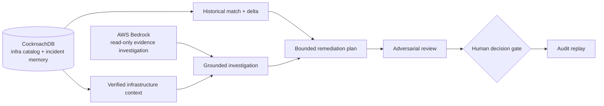

# EvidenceOps

EvidenceOps is an evidence-gated incident command center for infrastructure
operations. It combines a CockroachDB infrastructure catalog and vector-backed
incident memory with AWS Bedrock reasoning, then keeps any remediation behind
an explicit human decision and audit replay.

The local dashboard starts with a clearly labelled, real Linea Research
PHP-FPM/Elementor remediation record. It is a seed record, not live telemetry.

## Architecture



## Local setup

```powershell
npm install
Copy-Item .env.local.example .env.local
npm run dev
```

Open [http://localhost:3000/dashboard](http://localhost:3000/dashboard) and
sign in with the local operator credentials in your untracked `.env` file.

For the CockroachDB-backed path, populate `COCKROACHDB_URL`, run the seed, and
start the app:

```powershell
npm run cockroach:seed
npm run dev
```

The active seeded record is
`40000000-0000-4000-8000-000000000006`: the confirmed Linea Research
PHP-FPM pool-exhaustion incident caused by live Elementor regeneration.

## Verification

```powershell
npm run check
```

`/api/health` is public. `/dashboard` and incident APIs require the local
operator session. See [local authentication](docs/local-auth.md) and the
[Lightsail deployment guide](docs/lightsail-deployment.md).
