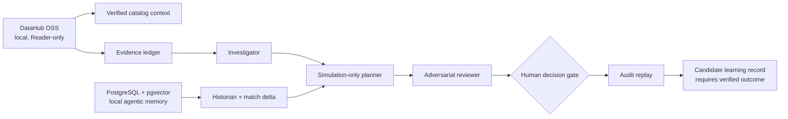

# RecallOps

RecallOps is an agentic incident command center that combines current organizational data context with durable, evidence-backed operational memory.

> DataHub knows what an incident can affect; RecallOps remembers what worked, why it worked, and what must be re-verified.

**License:** [Apache-2.0](LICENSE) · **Hackathon category:** Agents That Do Real Work

## Hackathon readiness

| Requirement | Repository status |
| --- | --- |
| Public, open-source source repository | Ready to publish; all application source, local Docker setup, and runbooks are included |
| Apache 2.0 license | Included at [LICENSE](LICENSE) |
| Clear setup and testing instructions | Included below, with local DataHub and PostgreSQL runbooks |
| Architecture and technical explanation | Included in this README and [SPEC.md](SPEC.md) |
| Project description and demo script | Included in [the submission runbook](docs/submission-runbook.md) |
| Public video under three minutes | Still required before Devpost submission |
| Final Devpost fields and repository/video URLs | Still required before Devpost submission |

### DataHub integration boundary

RecallOps uses authenticated, read-only DataHub catalog context to ground the
incident view. The repository also includes an MCP preflight that verifies the
allowed DataHub Reader toolset. The current browser-facing catalog card reads
the local DataHub GMS GraphQL endpoint directly rather than consuming MCP from
the worker runtime. That is a transparent implementation boundary, and moving
the runtime read path to DataHub MCP or Agent Context Kit is the clearest
remaining improvement for the strictest interpretation of the challenge.

## Current MVP

The first local product slice is an interactive incident-investigation prototype for a planted NYC Taxi freshness failure. It includes:

- an explicitly labeled fixture lineage blast radius;
- three stored historical resolutions with a contextual match;
- competing hypotheses with prototype evidence summaries;
- an adversarial review for each hypothesis; and
- a simulated human approval interaction.

The incident investigation is clearly labeled as a fixture. When local
PostgreSQL memory is configured, historical matches, decisions, and audit
replay are persisted and retrieved from the database; the UI says so. When a
local, read-only DataHub environment is configured, the console also displays
a separate **Verified catalog context** card with the source dataset, owners,
schema field count, and downstream assets read from that running instance. It
never relabels fixture investigation output as live.

The investigation itself is deliberately bounded and replayable: every agent
step cites evidence IDs; the historical match exposes its changed context and
non-transferable assumptions; the reviewer blocks execution without a current
source check; and the simulated human decision can be replayed with its
evidence chain and learning safeguards.

## Fixture API

The prototype exposes stable commands with PostgreSQL-backed memory when it is
configured, and a clearly labeled fixture fallback otherwise:

- `GET /api/incidents/INC-247` returns the typed incident projection and its historical-memory match.
- `POST /api/incidents/INC-247/decisions` records an idempotent simulated approval or review request.

Decision commands require `actorId`, `decision`, `planId`, `planVersion`, and `idempotencyKey`. The repository accepts only the seeded plan version and prevents a conflicting second decision.

## Live DataHub integration guardrails

The live DataHub phase starts with a compatibility and authentication smoke test, not the UI. The setup guide will pin the tested DataHub OSS, MCP Server, and CLI versions and document the copied compose configuration required for OSS access tokens.

The NYC Taxi sample is treated as input to verify, not a source of assumed facts: the app will use only assertion, ownership, and lineage values read from the running instance. Resolution write-back will be confirmed by a direct read of the written entity or aspect by URN, with bounded polling; catalog search is not used as write confirmation.

Historical similarity is also deliberately non-authoritative. The incident dossier will show shared context, changed context, and remaining assumptions before a historical resolution can inform a human-approved plan.

## Agentic memory

Agentic memory in RecallOps is not a chat transcript or an automatic playbook.
It is a durable PostgreSQL record of resolved incidents: their source asset,
assertion, severity, affected downstream assets, root cause, winning action,
outcome, verification requirements, and evidence ID. For a new incident,
RecallOps retrieves the most contextually similar stored resolutions using
source, assertion, severity, and lineage-overlap signals. It then presents a
`match delta`—shared context, changed context, and non-transferable
assumptions—before a human can reuse any diagnostic lead.

This makes memory useful without treating a prior resolution as authority.
Every proposed action remains simulated, evidence-gated, and replayable.

## Quick start

Requirements: Node.js 22.13 or newer.

```bash
npm install
npm run postgres:bootstrap
npm run postgres:api
npm run dev
```

Open `http://localhost:3000`.

Create an optimized build with:

```bash
npm run build
```

Run all local verification with:

```bash
npm run check
npm run postgres:smoke
```

The app works with its labeled fixture investigation when DataHub is not yet
configured. To enable verified catalog context, complete the DataHub setup in
[Integration configuration](#integration-configuration), then run
`npm run datahub:smoke`.

## Architecture



### Demo boundaries

| Capability | Demo status | Safety boundary |
| --- | --- | --- |
| DataHub ownership, schema, and lineage context | Live local read | Dedicated Reader token; no mutation tools |
| Agent investigation and action plan | Transparent fixture | All claims cite fixture evidence IDs |
| Historical match, decision, and audit replay | Live local PostgreSQL; stored resolutions are ranked by contextual evidence | Idempotency key and plan-version check |
| Resolution learning | Candidate only | Requires an outcome and review; never auto-promotes a root cause |
| PostgreSQL unavailable | Safe fixture fallback | The UI says `Memory fixture`; it never claims a database connection |

## Integration configuration

Copy `.env.example` to `.env.local` when adding live services. Never commit real credentials.

### DataHub MCP preflight

Docker Desktop and `uvx` are required for the local DataHub environment. Start
the pinned, authentication-enabled stack from PowerShell:

```powershell
.\infra\datahub\bootstrap-auth-enabled.ps1
```

After it is healthy, create a dedicated read-only service-account token, add it
to `.env.local`, and run:

```bash
npm run datahub:smoke
```

The smoke test requires authenticated `get_me`, `get_entities`, and
`get_lineage` MCP reads. It disables mutation and document-write tools, and
fails closed if a required tool is absent or write-capable tools appear.

Verified local combination: DataHub OSS `v1.6.0`, DataHub MCP Server `0.6.0`,
and DataHub CLI `1.6.0`, with metadata-service authentication enabled. The
MCP identity has DataHub's built-in **Reader** role: it can search and view
metadata but cannot edit metadata or administer the instance.

The current verified graph is DataHub's official bootstrap pack. The demo pair
is `fct_users_created` → `fct_users_deleted`, with four downstream ML features.
This is intentionally documented as bootstrap data, not NYC Taxi data.

To seed the pack on Windows, create a short-lived writer token separately,
place it only in `DATAHUB_SEED_TOKEN`, run `npm run datahub:seed`, and revoke
the token afterward. The command deliberately refuses to use the read-only MCP
token.

See [the DataHub preflight runbook](docs/datahub-preflight.md) for the
authentication and write-back verification rules.

### Local demo path

The hackathon rules explicitly allow a local DataHub quickstart. For the
submission, the recommended demo path is a local DataHub OSS instance plus
this local app: the `GET /api/datahub/context` route reads the local GMS
GraphQL API with a private Reader token and exposes only normalized metadata to
the browser. The token never leaves the server process. Follow the [local demo
runbook](docs/demo-runbook.md) to prepare the exact judge/demo flow.

A public DataHub deployment is optional, not a prerequisite for this MVP. If
one is added later, follow the [hosted DataHub deployment boundary](docs/hosted-datahub.md).

### PostgreSQL + pgvector local agentic memory

Start the local agent-memory database with:

```powershell
npm run postgres:bootstrap
npm run postgres:api
```

The helpers write local-only connection settings to `.env.local`, start
PostgreSQL, and expose a loopback-only REST bridge that lets the
Cloudflare-compatible app runtime access it over HTTP. Start the app and load
it once; it creates the `incident_dossiers` and
`historical_incident_memory` tables, enables the pgvector extension, and seeds
the active incident plus resolved historical records. This is RecallOps'
agentic memory: subsequent human decisions and audit replay state persist
across app restarts. See the [PostgreSQL runbook](docs/postgres-local.md).

## Devpost

- Project ID: `1373305`
- Draft: https://devpost.com/software/incident-doppelganger *(rename the Devpost publication separately when ready)*

The project has not been submitted to a hackathon yet.

Use the [submission runbook](docs/submission-runbook.md) for the under-three-
minute demo script, Devpost copy, and final checklist.
