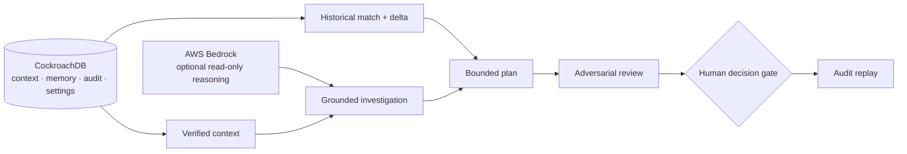

# EvidenceOps

EvidenceOps is an evidence-gated incident command center for infrastructure
operations. It combines a CockroachDB infrastructure catalog and historical
memory with optional AWS Bedrock reasoning, then keeps investigation,
remediation, and learning behind explicit human review.

It is a working MVP intended for a single local operator today, with
organization-scoped encrypted settings and an inbound Slack review flow that
prepare it for a later multi-user model.

## Current product state

- Public landing page and protected incident dashboard.
- Local operator authentication with signed, HTTP-only sessions; Clerk is not
  used.
- CockroachDB-backed infrastructure context, incident memory, audit replay,
  cluster-health evidence, and read-only table-statistics evidence.
- Optional, evidence-validated Bedrock investigation flow.
- Anonymized incident seed portfolio; seeded records are clearly labelled and
  never represented as live telemetry.
- Encrypted, organization-scoped Slack settings in CockroachDB.
- Signed Slack Events API intake with an allowlist, self-message filtering,
  durable deduplication, and redacted application logs.
- A human review queue: only a reviewed intake can be explicitly promoted into
  a redacted `needs_review` incident.

EvidenceOps does **not** perform automatic remediation, execute a Slack
message, or treat an AI response as a production change.

## Architecture



The complete component, trust-boundary, Slack intake, and Lightsail topology
are documented in [docs/architecture.md](docs/architecture.md).

## Safety model

| Area | Guardrail |
| --- | --- |
| Evidence | Investigation is bounded to immutable, server-side evidence and must cite it. |
| Historical memory | A similar incident supplies diagnostic context, never an automatically transferable fix. |
| Slack ingress | Every request is HMAC-verified, time-bounded, allowlisted, deduplicated, and filtered for bot/self messages. |
| Privacy | Slack message content is redacted before durable intake storage; raw bodies, credentials, and full identifiers are never written to application logs. |
| Incident creation | An operator must review an intake and explicitly promote it; promotion starts a `needs_review` incident only. |
| Remediation | No write-back path is enabled. Any future change remains behind a separate human decision gate. |

## Local quick start

Requirements: Node.js 22.13 or later and npm.

```powershell
npm install
Copy-Item .env.example .env
```

At minimum, set the local operator values in `.env`:

```env
LOCAL_AUTH_EMAIL=operator@evidenceops.local
LOCAL_AUTH_PASSWORD=use-a-unique-long-password
LOCAL_AUTH_SESSION_SECRET=use-a-random-32-byte-or-longer-secret
SETTINGS_ENCRYPTION_KEY=base64-encoded-32-byte-key
```

For fixture-only local use, leave `COCKROACHDB_URL` blank. For the live
CockroachDB-backed path, set `COCKROACHDB_URL` and, where required,
`COCKROACHDB_CA_CERT_PATH`.

```powershell
npm run dev
```

Open [http://localhost:3000/](http://localhost:3000/), then sign in at
`/dashboard`. `/api/health` is the only public application health endpoint.

See [local authentication](docs/local-auth.md) for session details.

## CockroachDB-backed mode

The live path uses CockroachDB for the infrastructure catalog, incident
records, vector-backed historical memory, audit data, encrypted organization
settings, Slack delivery deduplication, and Slack intake review records.

To prepare a new development database with the incident-memory portfolio, set
the CockroachDB and Bedrock embedding values in `.env`, then run:

```powershell
npm run cockroach:seed
npm run cockroach:phase3:verify
```

The ordered SQL migrations in `drizzle/` cover persistent Slack settings,
delivery deduplication, the review queue, and reviewed-intake promotion. Apply
them to each deployed CockroachDB database before enabling Settings or Slack
ingestion. They are additive and use only anonymized catalog context.

## Slack intake workflow

The Slack integration is implemented but remains inactive until an operator
configures it and the app is deployed at a public HTTPS URL.

1. Sign in and open `/settings`.
2. Save the Slack signing secret, bot user ID, and allowed channel IDs. These
   values are encrypted at rest and never returned by the UI.
3. Deploy the application and configure Slack’s Events API Request URL as
   `https://your-public-app-url/api/slack/events`.
4. Slack URL verification receives an immediate signed response.
5. An allowlisted human message creates one redacted `pending_review` intake.
6. An operator may mark it reviewed or dismissed. Only a reviewed intake can
   be promoted once into a `needs_review` EvidenceOps incident.

The app-level token field is retained for a future Socket Mode worker; it is
not required for the current HTTP Events API endpoint.

## Verification

```powershell
npm run check
```

This runs type checking, linting, a production build, API/rendering tests, and
Slack guard tests. The focused Slack tests cover request-signature validation,
replay-window rejection, allowlisting, self-message filtering, redaction,
deduplication, intake creation, and reviewed-only promotion.

## Deployment

The intended production topology is a single Ubuntu Lightsail instance:
Docker Compose binds the application to loopback, while the host’s existing
Nginx and Certbot installation own public ports 80 and 443.

Use [docs/lightsail-deployment.md](docs/lightsail-deployment.md) for the
host setup, environment file, Nginx, TLS, deploy command, and acceptance
checks. Do not deploy populated `.env` files, credentials, or certificate
material to Git.

Before connecting Slack, verify the public health endpoint, operator sign-in,
CockroachDB access, Settings persistence, and the review queue over HTTPS.

## Project boundaries and next work

The current MVP is deliberately single-operator and does not include
multi-organization membership, automatic issue creation, a Socket Mode worker,
or production write-back. Those capabilities should be added only with their
own authorization model, audit requirements, and end-to-end tests.

## References

- [Architecture and trust boundaries](docs/architecture.md)
- [Local authentication](docs/local-auth.md)
- [CockroachDB Managed MCP boundary](docs/cockroachdb-managed-mcp.md)
- [CockroachDB agent-skills evidence](docs/cockroachdb-agent-skills.md)
- [Lightsail deployment guide](docs/lightsail-deployment.md)
