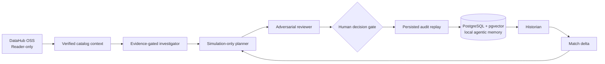

# RecallOps — Product and Engineering Specification

**Hackathon category:** Agents That Do Real Work  
**Project ID:** `1373305`  
**Primary repository:** `C:\Users\arkad\Documents\codex-doppelganger`

## 1. Product thesis

RecallOps is an evidence-gated incident command center for data and ML
operations. It combines two types of context that are normally disconnected:

- **Live organizational context from DataHub:** ownership, schema, lineage, and
  downstream impact for the asset currently under investigation.
- **Durable agentic memory in PostgreSQL:** resolved incidents, their evidence,
  root causes, bounded actions, outcomes, and verification requirements.

> DataHub knows what an incident can affect; RecallOps remembers what worked,
> why it worked, and what must be re-verified.

The system treats historical resolution as a diagnostic lead, not an authority.
It makes the differences between a prior incident and the current incident
explicit, keeps execution simulated, and requires a human decision before the
workflow state changes.

## 2. User problem and outcome

During an incident, data teams must reconstruct asset context, downstream
impact, earlier failures, and the safety conditions for remediation. This is
slow because the information is fragmented across a catalog, operational
notes, and people’s memory.

RecallOps creates one incident dossier that:

1. reads verified context from DataHub with a Reader-only identity;
2. maps blast radius and presents evidence-backed hypotheses;
3. retrieves comparable resolved cases from durable PostgreSQL memory;
4. exposes shared context, changed context, and non-transferable assumptions;
5. proposes a simulation-only plan and lets an adversarial reviewer challenge
   it; and
6. records a human decision with idempotency and replayable audit history.

## 3. Agentic-memory model

Agentic memory is durable operational knowledge, not an opaque prompt history.
Each resolved-memory record contains:

| Field | Purpose |
| --- | --- |
| Source asset and assertion | Grounds retrieval in the failing data contract |
| Severity and downstream assets | Captures operational impact |
| Root cause and winning action | Preserves the resolved diagnostic path |
| Outcome and duration | Gives a reviewer context for reuse |
| Verification requirements | Identifies what cannot safely transfer |
| Evidence ID and resolution time | Keeps the memory auditable and ordered |

The current implementation retrieves memory deterministically using source
asset, assertion, severity, and downstream-lineage overlap. PostgreSQL’s
`pgvector` extension is enabled for a later semantic-retrieval expansion; no
embedding-based claim is made in the MVP.

## 4. Product boundaries

### Live and local

- DataHub runs locally and is read through an authenticated Reader token.
- PostgreSQL and PostgREST run locally in Docker and bind only to loopback
  ports.
- The current incident investigation is a deliberately labeled demo fixture.
- Historical records, human decisions, and audit replay are persisted in local
  PostgreSQL when configured.

### Safety

- No DataHub mutation tools are enabled for the application identity.
- Historical matches cannot directly execute an action.
- Every recommendation cites evidence and carries explicit unknowns.
- The human decision is idempotent and bound to a specific remediation-plan
  version.
- A stored resolution becomes a candidate learning record only after verified
  outcome review.

## 5. Architecture



### Runtime components

| Component | Responsibility |
| --- | --- |
| Vinext/Cloudflare-compatible app | Incident console and API routes |
| DataHub OSS | Read-only ownership, schema, and lineage context |
| PostgreSQL + pgvector | Incident dossier, historical memory, decisions, audit state |
| PostgREST | Loopback-only HTTP bridge for the worker-compatible runtime |
| Fixture adapters | Transparent seeded investigation content for the MVP demo |

## 6. Core workflow

1. RecallOps loads `INC-247`, a planted NYC Taxi freshness incident.
2. The app requests current DataHub context separately from the fixture
   investigation and labels the result as verified catalog context.
3. The historian searches stored resolved incidents and selects `INC-184` at
   92% contextual similarity.
4. Match delta distinguishes reusable diagnostic context from changed assets
   and verification requirements.
5. The planner proposes a simulated action; the reviewer blocks unchecked
   assumptions.
6. The operator approves or requests review. The decision and resulting audit
   event are persisted with an idempotency key and plan-version check.
7. Audit replay reveals evidence, agent checks, human decision, and the
   guarded learning outcome.

## 7. Persistent storage

The local PostgreSQL schema has two primary tables:

| Table | Contents |
| --- | --- |
| `incident_dossiers` | Current incident projection, decision, and event history |
| `historical_incident_memory` | Resolved incidents used for contextual retrieval |

The bootstrap script creates PostgreSQL with a Docker named volume. The local
bridge exposes only `127.0.0.1:5434`; the database itself exposes only
`127.0.0.1:5433`. Secrets remain in untracked `.env.local`.

## 8. Local demo setup

```powershell
npm install
npm run postgres:bootstrap
npm run postgres:api
npm run dev
```

Configure a local DataHub Reader token in `.env.local`, then verify the two
live integrations:

```powershell
npm run postgres:smoke
npm run datahub:smoke
```

See [README.md](README.md), [the PostgreSQL runbook](docs/postgres-local.md),
and [the DataHub preflight runbook](docs/datahub-preflight.md) for the exact
configuration and safety boundaries.

## 9. Demo evidence

The demo should show:

1. the connected DataHub catalog card and its Reader-only boundary;
2. the `PostgreSQL connected` status and three stored resolutions searched;
3. `INC-184` at 92% with its match delta;
4. the human decision gate and replayable audit timeline; and
5. the local-only Docker setup and smoke-test output.

## 10. Near-term evolution

- Add embedding generation and a pgvector similarity query while retaining the
  existing structured signals and match delta.
- Add explicit outcome review that promotes a completed resolution into a new
  memory record only after human validation.
- Replace selected fixture investigation steps with live, evidence-cited
  DataHub reads while retaining the same safety gates.
- Add a reset command for deterministic demo recordings.
