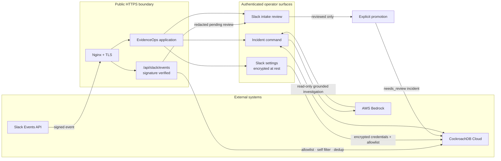
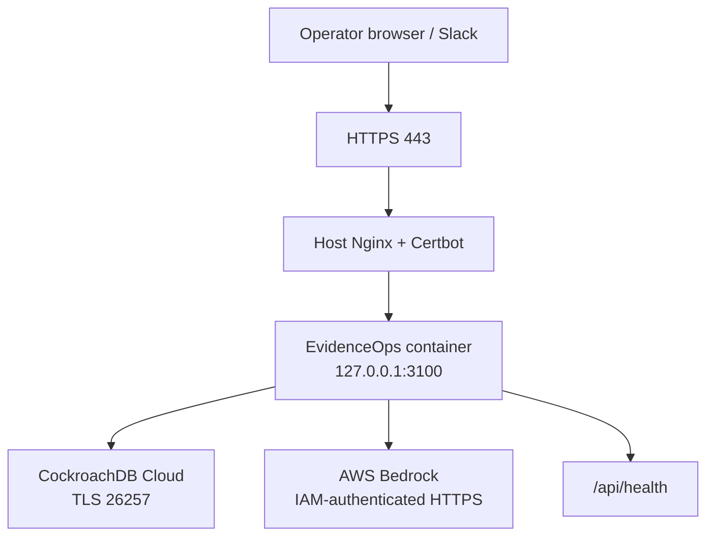

# EvidenceOps architecture

EvidenceOps is an evidence-gated incident workflow. Inbound alerts become
reviewable evidence; no message, model output, or historical match can execute
a change by itself.

## Safety boundaries

| Boundary | Control |
| --- | --- |
| Public Slack endpoint | HMAC signature and five-minute replay window; the endpoint is public only because Slack authenticates every request. |
| Slack intake | Channel allowlist, bot/self-message filtering, durable event-ID deduplication, and no message body in application logs. |
| Persistent settings | Organization-scoped encrypted payloads in CockroachDB; secrets are write-only from the operator UI. |
| Intake promotion | An operator must first review an intake, then explicitly promote it. Promotion creates a redacted `needs_review` incident only. |
| AI investigation | Bedrock receives an immutable evidence bundle and must cite evidence. It cannot execute remediation. |
| Remediation | A separate human decision gate remains mandatory; deployment does not enable write-back. |

## Deployment topology

The production target is a single Ubuntu Lightsail instance. Docker Compose
binds EvidenceOps on loopback only; the existing Nginx and Certbot installation
owns public ports 80 and 443. CockroachDB Cloud and Bedrock remain managed
external dependencies.

Use the [Lightsail deployment guide](lightsail-deployment.md) for the exact
host setup and acceptance checks.
